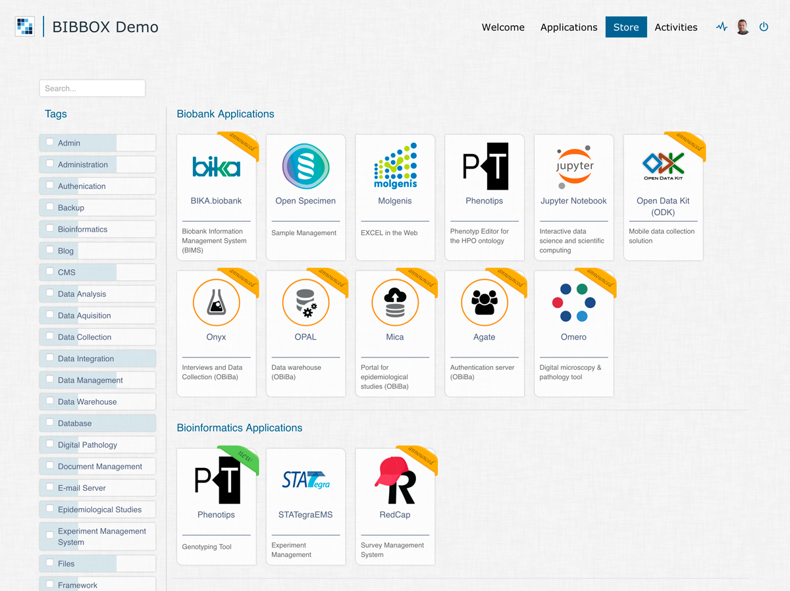
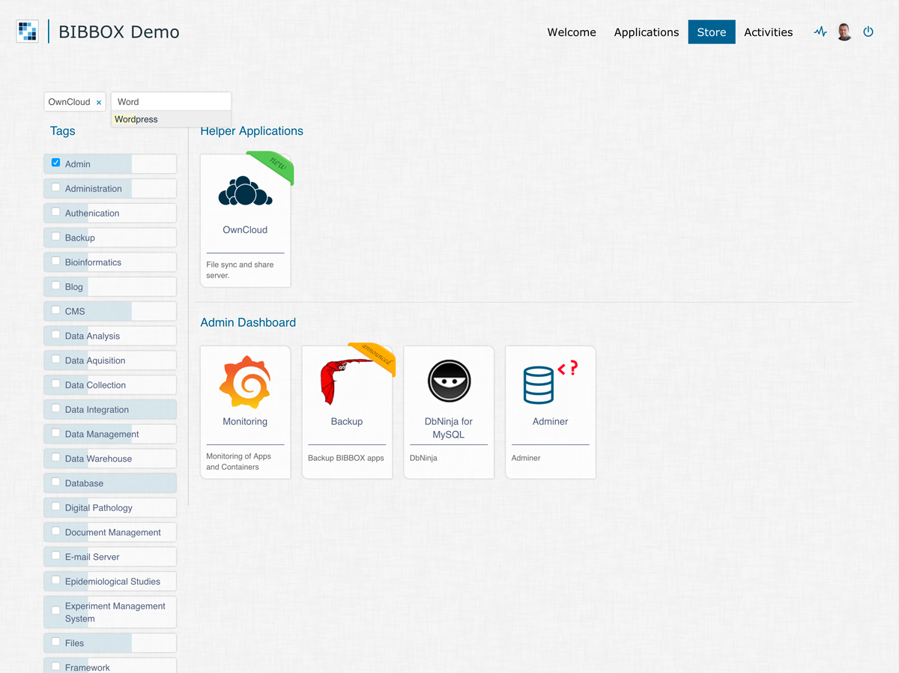
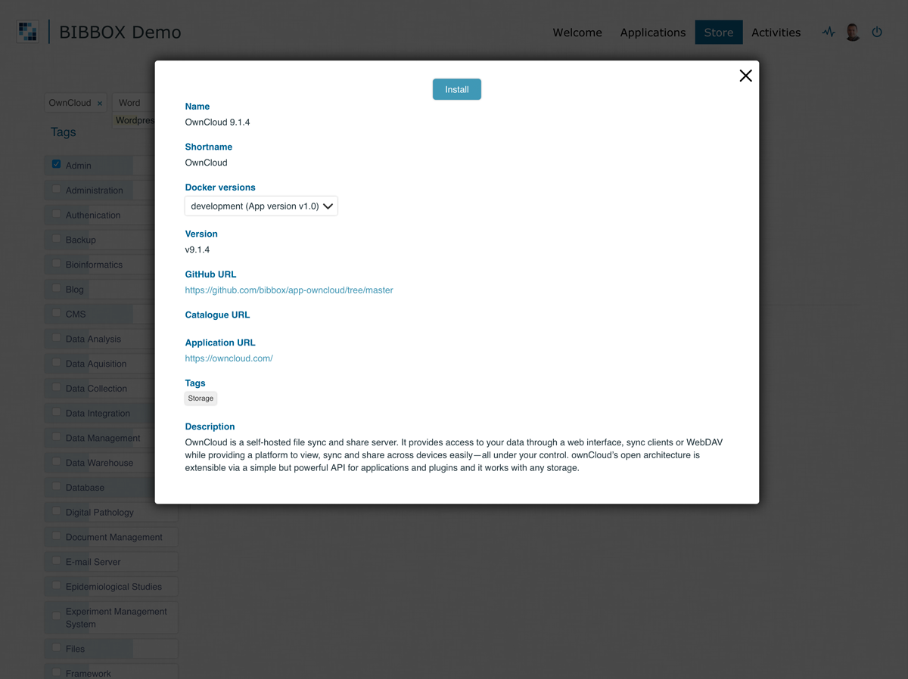
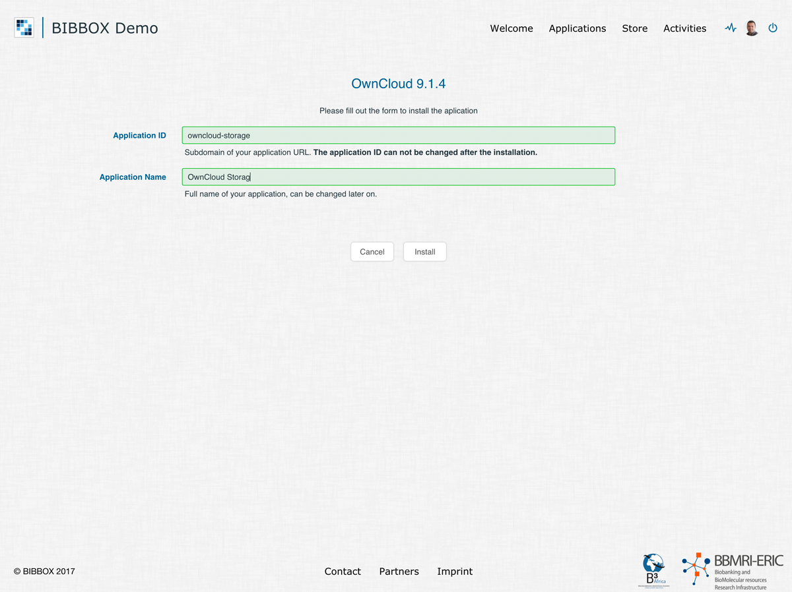
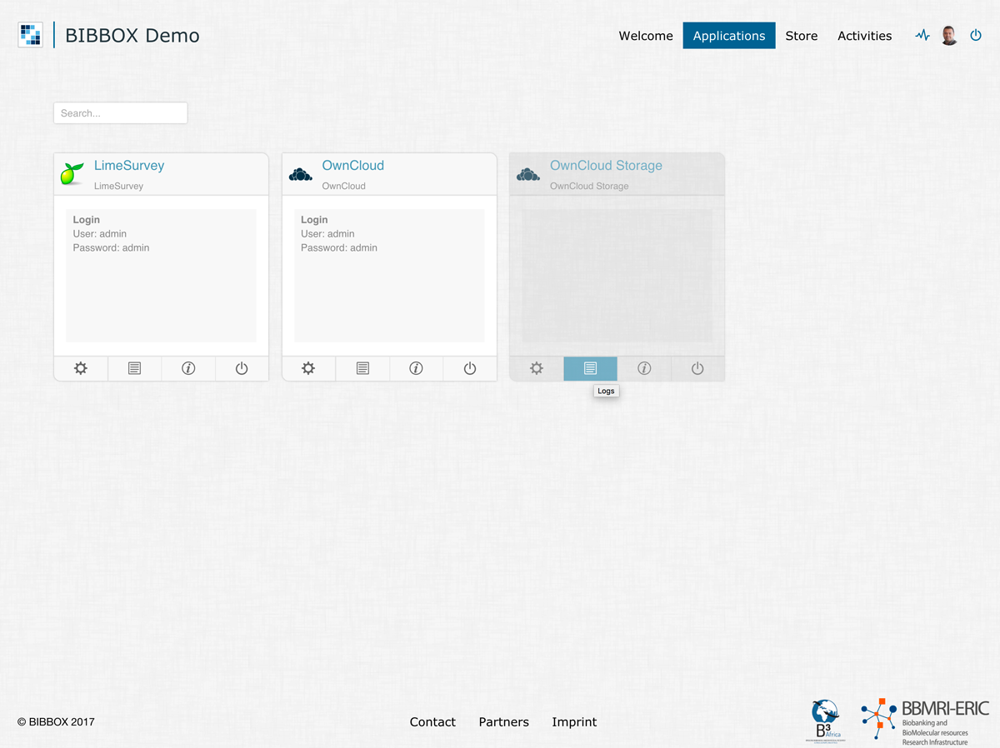
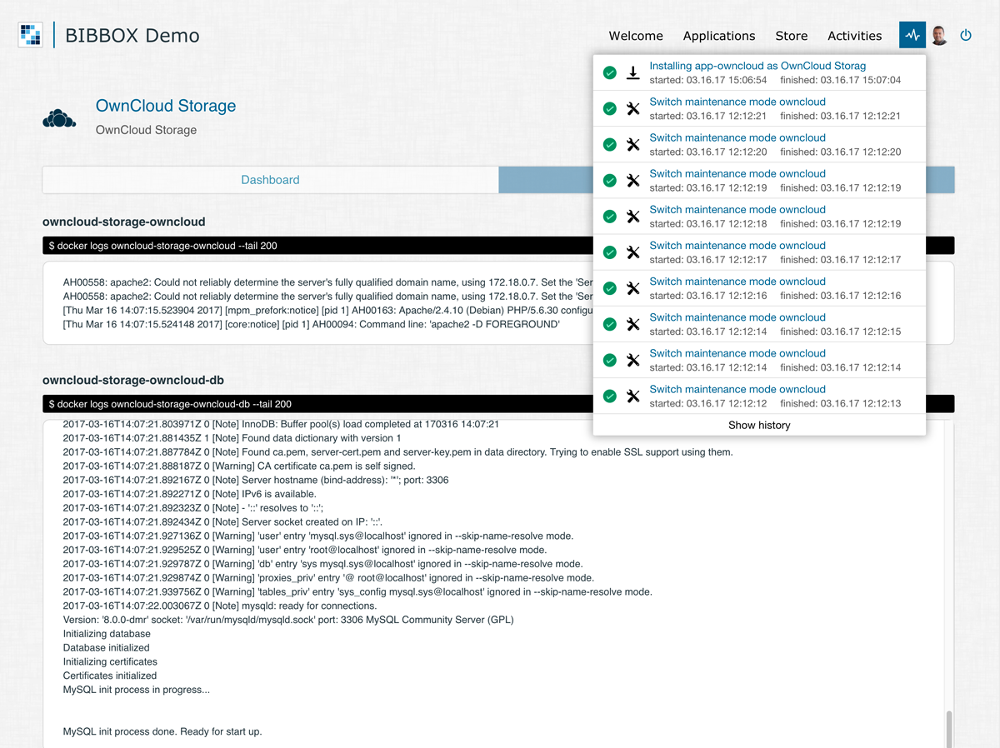
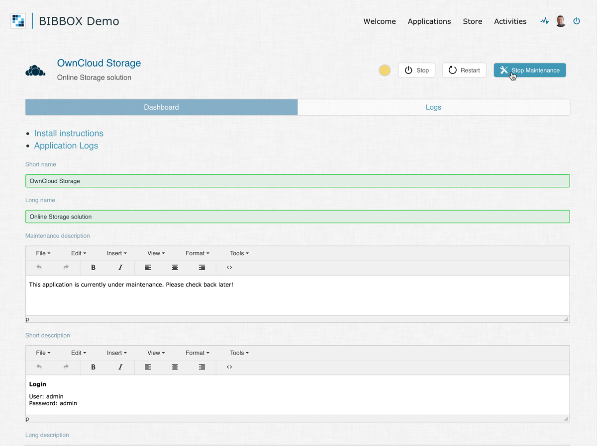
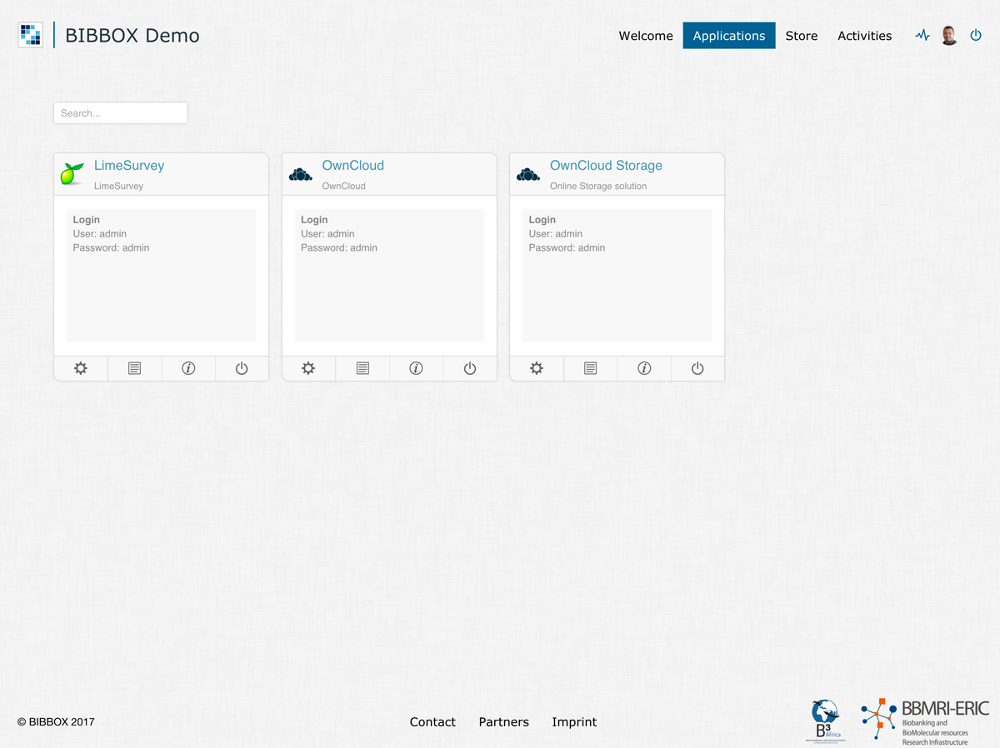
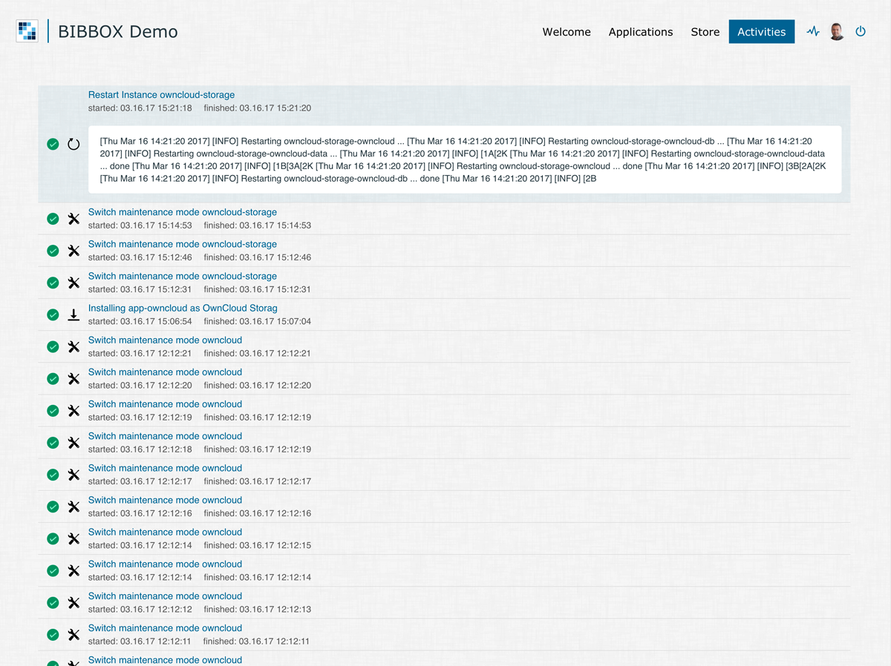

# About this guide

This guide is meant to show an BIBBOX administrator how to use the system, install new applications and do some troubleshooting in case something goes wrong. It is recommended to have a look into this guide before using BIBBOX for the very first time and whenever questions arrive.

## Installing Applications

Installing and deleting applications in BIBBOX is quite simple. Of course it depends on the application itself until it is fully usable, but here is a brief guide on how to install some new applications from the BIBBOX store.

* You can find a list of all applications available to your kit under the **Store** menu of your BIBBOX portal. These apps are grouped by their usage scenarios and show information about their availability with colorful ribbons, eg. **announced** means, this application will soon be available and **new** means, this application has just been released.

* Every application has its own tags for easier classification of what they offer. You can easily filter for specific applications using either the facet search or the search bar to the left.

* By clicking on an application an overlay panel appears, revealing additional information about the application. Here you can find out more about the application itself, but also about the different releases that are available for installation. If the app has already been released, you can start its installation by clicking **Install** in this very overlay.

* After hitting the **Install** button, a new screen with an installation form appears. Depending on the application, this form could offer some additional fields but the **Application ID** and **Application Name** fields are common among all applications. The **Application ID** identifies this very installation within your BIBBOX and has to be a unique string with only lowercase letters, numbers and the '-' character. If your entered ID is available and in the right format, the field will be green, otherwise it will be red. The **Application Name** is the Title of the application that will be visible on the **Applications** menu. It can be changed later on and contain uppercase and lowercase characters, numbers, spaces and the '-' character. Again, this field will let you know wheter your input is in the right format or not. After filling out the fields, click the **Install** button to start the installation.

* After starting the installation, a new app tile will appear on the **Applications** menu, indicating that the app has been added. By default, the tile will be transparent, this means it is currently in maintenance mode. While the installation is still running in the background, you will see a spinning icon in the upper right corner. You can also watch the installation progressing by clicking the **Logs** button of the application tile.

* In the **Logs** page, you will find a the latest lines of the applications logs, e.g. for the app or the database. This log view will be updated every 3 seconds and comes in handy if something doesn't work as intended, or if an installation takes longer than expected. The spinning icon in the upper right corner will disappear if no activities (installations, deletes, maintenance changes etc.) are running. Clicking on the activity button will show you more information about the 10 latest activities.

* The application's **Dashboard** can be reached either from the **Dashboard** button in the app tile (cog symbol) or through the tab navigation in the **Logs** page. The dashboard is your application's control center and important for managing how your app is displayed in BIBBOX. Here you can disable the maintenance mode if the application is running (this will make the app tile white instead of transparent). You can also stop, restart and delete (if not running) the application, set a maintenance description and edit the **Short Description** which is displayed within the app tile. You can also take some notes and save your changes in the bottom of the page. If you are looking for a detailed guide on how to set up the application after its installation in BIBBOX, you can find it by clicking the **Install Instructions** link in the dashboard. Here is another tip: you can also open your application by clicking its icon in the top left corner of either the dashboard, the logs page or the app tile!

* Here you can see the up and running application in the **Applications** menu. The maintenance mode is disabled, the login information entered in the apps **Short description** and the app is ready for usage. As you can also see, it is absolutely no trouble to run multiple installations of the same application in BIBBOX.

* Here is one last tip for viewing the status of you application's installation. Each activity like installing, deleting, stopping, starting, maintenance change etc. is logged in the activity history. You can find this page by clicking the **Activity** menu item. In the history, you will get detailed information or log snippets by clicking an activity.

* That's pretty much all to know about installing applications in BIBBOX. You are now ready to set up your own toolset!

## Folder Structure for Applications

### /opt/bibbox/application-store

This folder is a copy of all github repositories listed in the eB3Kit.json file. The application-store (repository) is also located in this folder. The folder structure represents the same structure as the github version folder structure for easy access via the linked folder structure in the datastore (your.url/datastore). 

As an example for the aPhenotips the structure looks like:

| base-url        | application folder         | Version           | Decription        |
|-----------------|----------------------------|-------------------|-------------------|
| /opt/bibbox/application-store/ | app-phenotips/blob/ | |
|  |  | V1-0-9/ | taged version of the app |
|  |  | development/ | the master branch of the app |

## Troubleshooting
  - Login via SSH
  
        host:$ vagrant ssh
  - Check if you have enough diskspace left 
       
        bibbox:$ sudo df -h *

  - Check if Apache is running
  
          bibbox:$ sudo service apache2 status

  - Check the liferay log

          bibbox:$ tail -f /opt/liferay/tomcat-8.0.32/logs/catalina.out

## Under construction
### How to start the portal
### How to install an App
- The App Store
- App Dashboard / GUI
- Working in the terminal
### Export / Import / Backup of Apps

