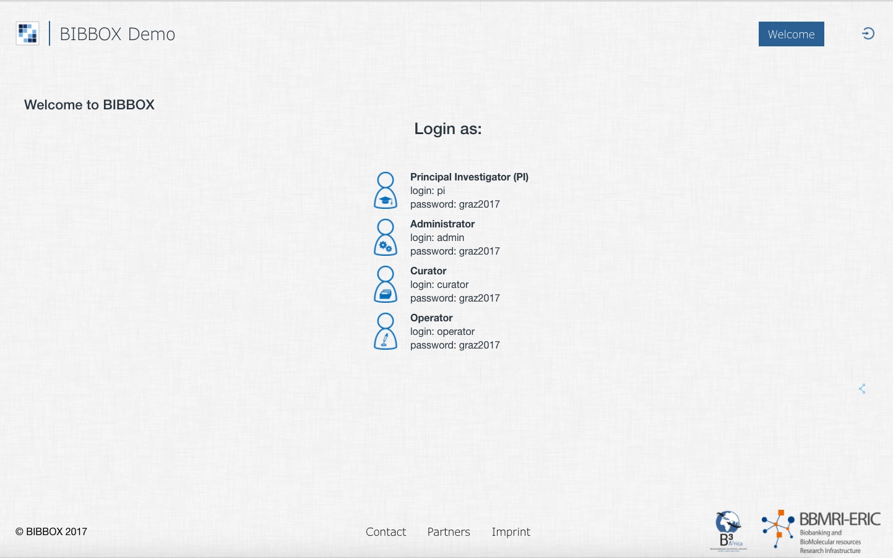
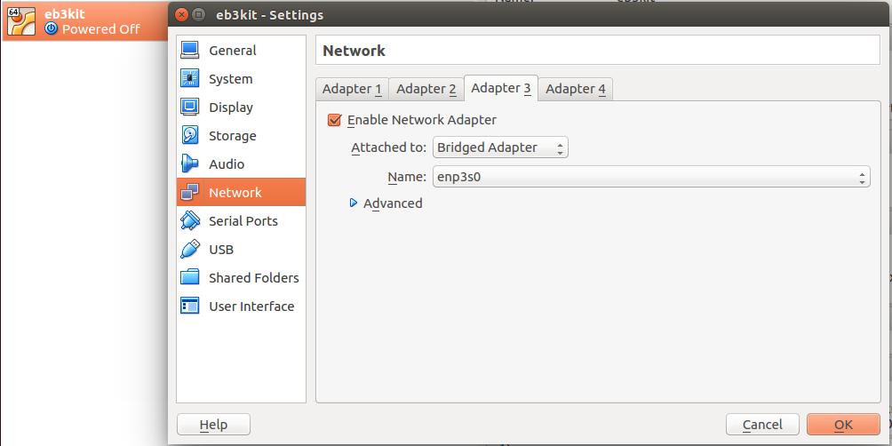

# Requirements

### Hardware

**Minimum**

The following will show you the minimum requirements of the BIBBOX virtual machine. Please note, that installing any applications within BIBBOX will require additional resources!

* CPU cores: 1
* Memory: 4096 MB
* Disk space: 20 GB

**Recommended for Development**

For development purposes we recommend a virtual machine with the following specifications:

* CPU cores: 4
* Memory: 8192 MB
* Disk space: 100 GB

**Production**

For production, please calculate the additional resources you will need, depending on the applications you are going to install within the BIBBOX.


### Software

* Download and install Git -> <https://git-scm.com/>
* Download and install Vagrant -> <https://www.vagrantup.com>
* Download and install VirtualBox -> <https://www.virtualbox.org>


The automatic BIBBOX setup depends on multiple repositories and one ZIP file download link:

* Liferay ZIP file: <http://downloads.bibbox.org/liferay-ce-portal-tomcat-7.0-ga3.zip>
* BIBBOX Repository 'sys-bibbox-vmscripts': <https://github.com/bibbox/sys-bibbox-vmscripts>
* BIBBOX Repository 'sys-bibbox-frontend': <https://github.com/bibbox/sys-bibbox-frontend>
* BIBBOX Repository 'sys-bibbox-backend': <https://github.com/bibbox/sys-bibbox-backend>
* BIBBOX Repository 'sys-activities': <https://github.com/bibbox/sys-activities>
* BIBBOX Repository 'sys-idmapping': <https://github.com/bibbox/sys-idmapping>


# Configuration

***Make sure to configure your settings before running the installation process!***


### Virtual machine configuration

The following parameters are available to configure your virtual machine. You can change them in `Vagrantfile`:

| Parameter        | Description                                                                                      | Default           |
|------------------|--------------------------------------------------------------------------------------------------|-------------------|
| vmname           | Name of your virtual machine.                                  	                              | eB3Kit            |
| bibboxbaseurl    | Base url of your BIBBOX installation. Needs to match 'bibboxbaseurl' parameter in 'environments\production\manisfests\config.pp'. <sup>1</sup>                                                                       | eb3kit.bibbox.org |
| cpus             | Number of CPU cores assigned to the virtual machine.                                             | admin@bibbox.org  |
| memory           | Total amount of memory in MB (RAM) available to the virtual machine.                             | 8192              |
| disksize         | Amount of additional disk space in GB (hard drive). Needs change in `resources/add_disk.sh`.     | 301      	      |
| diskname         | The disk file will be named "disk-**diskname**.vdi".                                             | 301GB             |
| ip               | The static IP to your BIBBOX within the host's network.                                          | 192.168.10.10     |
| http_port        | The port to your BIBBOX within the host's network.                                               | 80                |
| ssh_vagrant_port | Port for SSH access used internally by Vagrant.                                                  | 2230              |
| ssh_port         | Port used for SSH access from outside the host machine.                                          | 2231              |

**If you have a domain please follow step 5a). If you are testing it locally without a domain please follow step 5b) or 5c).**

### BIBBOX configuration

The following parameters are available to configure your BIBBOX. You can change them in `environments/production/manifests/config.pp`:

| Parameter     | Description                                                                                      | Default           |
|---------------|--------------------------------------------------------------------------------------------------|-------------------|
| bibboxkit     | Name of the BIBBOX kit, **currently only eB3kit is available!**                             	   | eB3Kit            |
| bibboxbaseurl | Base url of your BIBBOX installation. Needs to match 'bibboxbaseurl' parameter in 'Vagrantfile'. | eb3kit.bibbox.org |
| serveradmin   | Mail address of the administrator.                                                               | admin@bibbox.org  |
| db_user       | User of the Liferay database.                                                                    | liferay           |
| db_password   | Password of the Liferay database.                                                                | bibbox4ever	   |
| db_name       | Name of the Liferay database.                                                                    | lportal           |


# Quick installation guide

If you're already familiar with the BIBBOX installation process and only need a little reminder, this guide is for you.

1. Clone the Git repository, `git clone https://github.com/bibbox/kit-eb3kit.git your-vm-name`
2. In terminal, navigate to the repository, `cd your-vm-name`
3. Edit the VM and BIBBOX configuration as described above, `nano Vagrantfile` and `nano environments\production\manisfests\config.pp`
5. Run the setup by executing the command `vagrant up` from your base directory.
6. Wait while your BIBBOX is being installed (can take quite long, depending on internet connection)
7. Configure your host's proxy or DNS to redirect to the BIBBOX VM at **http://bibboxbaseurl**, where **bibboxbaseurl** is your the domain or subdomain BIBBOX is running on, eg. **demo.bibbox.org**.
   You can also access the BIBBOX by IP and port **<http://192.168.10.10:80>** (replace IP and port with your custom configuration), but **in order to install any applications, you will need a domain!** If you don't have one, we recommend DNSChef for faking one.
8. You can log in to your BIBBOX with the users ***bibboxadmin***, ***admin***, ***pi***, ***curator*** and ***operator***. For all users the default password is ***graz2017***.
9. To configure the liferay portal of your BIBBOX, log in as user ***bibboxadmin***.


# Detailed installation guide

### 1.) Setting up the requirements

In order to run the automatic BIBBOX-setup, you need to have Git, Vagrant and VirtualBox installed on your host machine.

#### If your host machine is a local PC or Mac, you can download those tools from their official websites:

<https://git-scm.com/downloads>


<https://www.vagrantup.com/downloads.html>


<https://www.virtualbox.org/>


#### If your host is a Linux machine or an Linux based remote server, you can instead install these tools with **apt-get**:

`$ sudo apt-get update`

`$ sudo apt-get install git`

`$ sudo apt-get install vagrant`

`$ sudo apt-get install virtualbox`


## 2.) Cloning the installer scripts

Next, you need to choose an directory to clone the installation scripts to.

On Linux based systems you can create a new directory with this command:

`mkdir /path/to/directory-name`

Now navigate to the directory using this command:

`cd /path/to/directory-name`

From there you can clone the repository <https://github.com/bibbox/kit-eb3kit.git> either with the GitHub client for Windows and Mac <https://desktop.github.com/> or simply with the following command:

`git clone https://github.com/bibbox/kit-eb3kit.git your-bibbox-name`

Once the repository has finished cloning, navigate into it by using the following command:

`cd your-bibbox-name`


## 3.) VM and BIBBOX configuration

***Make sure to configure your settings before running the installation process!***

If you are just trying to set up a demo, you should at least check out and edit **required** parameters, but be sure to change everything to your needs before setting up a production machine.


#### Virtual machine configuration

The following parameters are available to configure your virtual machine. You can change them in `Vagrantfile`.
On Linux based systems you can edit this file with `nano Vagrantfile` and save it with **Control + O** and then **Enter** after you are done.

**Required parameters:**

* bibboxbaseurl
* ip
* http_port
* ssh_vagrant_port
* ssh_port

| Parameter        | Description                                                                                      | Default           |
|------------------|--------------------------------------------------------------------------------------------------|-------------------|
| vmname           | Name of your virtual machine.                                  	                              | eB3Kit            |
| bibboxbaseurl    | Base url of your BIBBOX installation. Needs to match 'bibboxbaseurl' parameter in 'environments\production\manisfests\config.pp'.                                                                       | eb3kit.bibbox.org |
| cpus             | Number of CPU cores assigned to the virtual machine.                                             | admin@bibbox.org  |
| memory           | Total amount of memory in MB (RAM) available to the virtual machine.                             | 8192              |
| disksize         | Amount of additional disk space in GB (hard drive). Needs change in `resources/add_disk.sh`.     | 301               |
| diskname         | The disk file will be named "disk-**diskname**.vdi".                                             | 301GB             |
| ip               | The static IP to your BIBBOX within the host's network.                                          | 192.168.10.10     |
| http_port        | The port to your BIBBOX within the host's network.                                               | 80                |
| ssh_vagrant_port | Port for SSH access used internally by Vagrant.                                                  | 2230              |
| ssh_port         | Port used for SSH access from outside the host machine.                                          | 2231              |

This is how it looks like in the file:

```
# Name of the virtual machine
  # default: "eb3kit"
  vmname = "eb3kit"
  
  # Base url the bibbox kit (should match puppet config file)
  # default: "eb3kit.bibbox.org"
  bibboxbaseurl = "eb3kit.bibbox.org"
  
  # Number of assigned CPU cores
  # default: 4
  cpus = 4
  
  # Total amount of memory in MB (RAM)
  # default: "8192" (8GB)
  memory = "8192"
  
  # Amount of additional disk space in GB (hard drive)
  #
  # IMPORTANT IF YOU CHANGE THE DEFAULT VALUE!!!
  #  - Also replace '300' with your disksize value - 1 in "resources/add_disk.sh"
  #  - So if you choose 100 as disksize, replace 300 with 99 in "resources/add_disk.sh"
  #
  # default: 301
  disksize = 301
  
  # Name of the disk
  # default "301GB"
  diskname = "301GB"

  # Static IP and port within the host's network
  # ip default: "192.168.10.10"
  # http_port default: 80
  ip = "192.168.10.10"
  http_port = 80
  # https_port = XXXX
  
  # Ports used for SSH connection
  # ssh_vagrant_port is only for Vagrant internally
  # default: 2230
  # ssh_port is used to connect from outside
  # default: 2231
  ssh_vagrant_port = 2230
  ssh_port = 2231
```

#### BIBBOX configuration

The following parameters are available to configure your BIBBOX. You can change them in `environments/production/manifests/config.pp`.
On Linux based systems you can edit this file with `nano environments/production/manifests/config.pp` and save it with **Control + O** and then **Enter** after you are done.

**Required parameters:**

* bibboxbaseurl
* serveradmin

| Parameter     | Description                                                                                      | Default           |
|---------------|--------------------------------------------------------------------------------------------------|-------------------|
| bibboxkit     | Name of the BIBBOX kit, **currently only eB3kit is available!**                            	   | eB3Kit            |
| bibboxbaseurl | Base url of your BIBBOX installation. Needs to match 'bibboxbaseurl' parameter in 'Vagrantfile'. | eb3kit.bibbox.org |
| serveradmin   | Mail address of the administrator.                                                               | admin@bibbox.org  |
| db_user       | User of the Liferay database.                                                                    | liferay           |
| db_password   | Password of the Liferay database.                                                                | bibbox4ever	   |
| db_name       | Name of the Liferay database.                                                                    | lportal           |

This is how it looks like in the file:

```
# General Kit Information
# Currently only "eB3Kit" is available for bibboxkit
bibboxkit		=> "eB3Kit",
bibboxbaseurl	=> "eb3kit.bibbox.org",
serveradmin		=> "admin@bibbox.org",

# Database Information
db_user			=> "liferay",
db_password		=> "bibbox4ever",
db_name			=> "lportal"
```


## 4.) Running the installer

You can now run the automated installation process with the following command:

`vagrant up`

BIBBOX will automatically download all dependencies, set up an ***UBUNTU Trusty*** virtual machine, copy and symlink its contents and boot up the system.
Please note, that this can take quite a while depending on internet connection speed and processing power of the host machine.

Just leave your CLI open and do some other work while the installation is running.
You will recognize it has finished, when you see a message saying "Applied catalog in xyz seconds" and you can write commands in the terminal again.


## 5a.) Proxy, DNS configuration on server (with domain name)

After the installation has finished, BIBBOX will automatically start its internal configuration process and boot up the BIBBOX's Liferay portal.
Please note, that this process will take several minutes!

If you need more information on the Liferay boot process, you can view the log by connecting to the virtual machine with `vagrant ssh` and tailing the log file with `sudo tail -f -n 200 /opt/liferay/tomcat-8.0.32/logs/catalina.out`.

***Please note, that you cannot install any apps inside the BIBBOX without using a domain name instead of IP and port! You should get a domain matching the bibboxbaseurl in your configuration.***

After everything is finished, you can access your freshly installed BIBBOX in your browser at http://**192.168.10.10:1080** (replace the numbers with the IP port you configured before) on the host machine.


***In case you installed the BIBBOX on a remote server, you will need to do some additional configuration before you can access your BIBBOX from the web! See below:***


If you have access to your hosting providers administration panel you can also rent a domain name like "bibbox.org" and point it to that address.


If your hosting provider offers you an administration panel for managing domains and subdomains, you should use that to point to your BIBBOX. Otherwise you can do it yourself using this guide:

1. On your host machine navigate to your apache configuration directory. On Linux base machines this defaults to **/etc/apache2/sites-available**.
2. Create a file named **005-your-bibboxbaseurl.conf**. On Linux based systems you can do this with `nano 005-your-bibboxbaseurl.conf`.
4. Copy this proxy configuration into the file, change the ServerName, ServerAlias and the port you configured for your virtual machine. You should also change the name of the log files according to your vm name. Then save with **Control + O** and **Enter**.

        <VirtualHost *:80>
            ServerName eb3kit.bibbox.org
            ServerAlias *.eb3kit.bibbox.org

            <Proxy *>
                Order deny,allow
                Allow from all
            </Proxy>

            ErrorLog ${APACHE_LOG_DIR}/eb3kit.error.log

            # Possible values include: debug, info, notice, warn, error, crit,
            # alert, emerg.
            LogLevel debug

            CustomLog ${APACHE_LOG_DIR}/eb3kit.access.log combined

            ProxyRequests           Off
            ProxyPreserveHost On
            ProxyPass               /api/kernels/       ws://127.0.0.1:80/api/kernels/
            ProxyPassReverse        /api/kernels/       ws://127.0.0.1:80/api/kernels/
            ProxyPass               /       	        http://127.0.0.1:80/
            ProxyPassReverse        /       	        http://127.0.0.1:80/
        </VirtualHost>

5. Now navigate to the **/etc/apache2/sites-enabled** directory and create a symbolic link to your new proxy file with `ln -s ../sites-available/005-your-bibboxbaseurl.conf`. 
6. Next reload Apache to make it recognize your changes by running `service apache2 reload`.
7. You can now access the BIBBOX from anywhere in the web by calling your domain in the browser's address bar!




## 5b.) Local testing within the virtual machine (using UBUNTU GUI with fake domain)

The simplest way to try out a BIBBOX locally and without a DNS server and domain name, is to install a GUI for the machine and access the BIBBOX directly from within.
For this purpose, a small fake DNS tool named DNSmasq can be used and the BIBBOX then accessed using the browser from within the virtual machine.

In order to set up such a test BIBBOX, simply follow these steps:
 
* Run from terminal: `sudo apt-get update`
* Run from terminal: `sudo apt-get install ubuntu-desktop`
* If you are asked to confirm the installation, do so by entering `Y` and press ENTER
* If you are asked for anything else with a default value, just press ENTER
* Run from terminal: `sudo apt-get install dnsmasq`
* Run from terminal: `sudo passwd vagrant`
* Type and confirm a password of your choice (e.g. `bibbox4ever`)
* Run from terminal: `sudo nano /etc/dnsmasq.conf`
* Add this line: `address=/bibbox.local.test/192.168.10.10`. If you built your BIBBOX with Vagrant, replace the url and IP with the ones you used in Vagrantfile.
* Save with CTRL + O and ENTER and exit the editor with CTRL + X
* Run from terminal: `sudo /etc/init.d/dnsmasq restart`
* Open up your BIBBOX virtual machine from VirtualBox GUI
* Log in with user **vagrant** and your password
* Access your BIBBOX from a browser like Firefox with URL `bibbox.local.test` or whatever you set in Vagrantfile
* Directly after the start of the virtual machine, it can take some minutes before the BIBBOX has fully loaded

## 5c.) Local testing from outside the virtual machine (using fake DNS and domain name)

If you would like to test the BIBBOX System locally, from outside the virtual machine and without a domain, you can use a DNS proxy (aka "Fake DNS") tool to simulate a domain address. You have two options for the IP address of the VM.

### 5c.1) If port 80 is available on your machine, you can have the "http_port" or an additional port forwarded to the VM. You need to check that port 80 is not already in use.

* If you have set the http_port already to 80 when you created the VM, you can start with continue with point **5c.3**.

* If you changed the http_port after you already built the VM you can run `vagrant reload --provision` to update the machine.

* You can also add an additional port forwarding rule in the config for port 80 

        config.vm.network :forwarded_port, host: 80,  guest: 80
        

### 5c.2) You can add an additional network adapter to the VM (you need an dhcp in your local network).

* Add an Network Adapter via the Virtualbox Manager GUI


* Add an Network Adapter via command line manager (add NIC 3 with a Bridged Interface). For limitations an Virtualbox Bridged networks for your operation system take a look at [here.](https://www.virtualbox.org/manual/ch06.html#network_bridged)

        # List your VMs
        $ VBoxManage list vms
            "eb3kit" {e1d37b44-35ee-4019-aaa3-1b393d7605ec}
        # Get the used Network adapters (replace eB3Kit with your vmname)
        $ VBoxManage showvminfo "eB3Kit" | grep NIC
            NIC 1:           MAC: 080027A4A694, Attachment: NAT, Cable connected: on, Trace: off (file: none), Type: 82540EM, Reported speed: 0 Mbps, Boot priority: 0, Promisc Policy: deny, Bandwidth group: none
            NIC 1 Settings:  MTU: 0, Socket (send: 64, receive: 64), TCP Window (send:64, receive: 64)
            NIC 1 Rule(0):   name = tcp1080, protocol = tcp, host ip = , host port = 1080, guest ip = , guest port = 80
            NIC 1 Rule(1):   name = tcp2231, protocol = tcp, host ip = , host port = 2231, guest ip = , guest port = 22
            NIC 2:           MAC: 080027456CD6, Attachment: Host-only Interface 'vboxnet1', Cable connected: on, Trace: off (file: none), Type: 82540EM, Reported speed: 0 Mbps, Boot priority: 0, Promisc Policy: deny, Bandwidth group: none
            NIC 3:           disabled
            .
            .
            .
        # Add the Network adapters NIC 3
        $ VBoxManage modifyvm "eB3Kit" --nic3 bridged
        # Select the host interface 
        $ VBoxManage list bridgedifs
            Name:            enp3s0
            GUID:            33706e65-3073-4000-8000-08606e73cdec
            DHCP:            Disabled
            IPAddress:       10.128.10.43
            NetworkMask:     255.255.255.0
            IPV6Address:     fe80:0000:0000:0000:e6a9:b6a6:8604:85b8
            IPV6NetworkMaskPrefixLength: 64
            HardwareAddress: 08:60:6e:73:cd:ec
            MediumType:      Ethernet
            Status:          Up
            VBoxNetworkName: HostInterfaceNetworking-enp3s0

            Name:            docker0
            GUID:            6b636f64-7265-4030-8000-0242bbcc18a2
            DHCP:            Disabled
            IPAddress:       172.17.0.1
            NetworkMask:     255.255.0.0
            IPV6Address:     
            IPV6NetworkMaskPrefixLength: 0
            HardwareAddress: 02:42:bb:cc:18:a2
            MediumType:      Ethernet
            Status:          Up
            VBoxNetworkName: HostInterfaceNetworking-docker0
        # Set the host interface for the Bridged Interface (in this example enp3s0)
        $ VBoxManage modifyvm "eB3Kit" --bridgeadapter3 enp3s0
        # Check configuration for NIC 3
        $ VBoxManage showvminfo "eb3kit" | grep "NIC 3"
            NIC 3:           MAC: 080027864F64, Attachment: Bridged Interface 'enp3s0', Cable connected: on, Trace: off (file: none), Type: 82540EM, Reported speed: 0 Mbps, Boot priority: 0, Promisc Policy: deny, Bandwidth group: none

Start the VM again and login via SSH (vagrant ssh):

        # Check the Network interfaces you should have a new like this below
        $ ifconfig -a
            .
            .
            .
            eth2      Link encap:Ethernet  HWaddr 08:00:27:0a:07:84  
                      BROADCAST MULTICAST  MTU:1500  Metric:1
                      RX packets:0 errors:0 dropped:0 overruns:0 frame:0
                      TX packets:0 errors:0 dropped:0 overruns:0 carrier:0
                      collisions:0 txqueuelen:1000 
                      RX bytes:0 (0.0 B)  TX bytes:0 (0.0 B)
            .
            .
            .
        # Setup the interface for dhcp configuration
        $ (sudo) vi /etc/network/interfaces
        # Add at the end of the file
          auto eth2
          iface eth2 inet dhcp
        # Restart the system
        $ (sudo) reboot

        # Check your IP address for the new network interface and use the ip for configuring DNSCchef (10.128.10.47)
        $ ifconfig
            .
            .
            .
            eth2      Link encap:Ethernet  HWaddr 08:00:27:bf:e4:80  
                      inet addr:10.128.10.47  Bcast:10.128.10.255  Mask:255.255.255.0
                      inet6 addr: fe80::a00:27ff:febf:e480/64 Scope:Link
                      UP BROADCAST RUNNING MULTICAST  MTU:1500  Metric:1
                      RX packets:236 errors:0 dropped:0 overruns:0 frame:0
                      TX packets:256 errors:0 dropped:0 overruns:0 carrier:0
                      collisions:0 txqueuelen:1000 
                      RX bytes:17597 (17.5 KB)  TX bytes:20054 (20.0 KB)
            .
            .
            .

* Add new Network Interface with vagrant (todo)

### 5c.3) Install DNSCchef
* Download the DNSChef tool <https://thesprawl.org/media/projects/dnschef-0.3.zip> (Depending on your browser you have to confirm the certificate or add the certificate to an exception list).
* Unzip the folder
* Create a file called **bibbox.ini**, replace the **bibbox.local.domain** with the **bibboxbaseurl** you selected and the ip address **192.168.10.10** with the IP your VM is accessible. (see for local system section above)

        [A] # Queries for IPv4 address records
        *.bibbox.local.domain=192.168.10.10

* Run: **sudo python dnschef.py --file bibbox.ini -q** in the folder
    
    If you get an error similar to this:
    
        Traceback (most recent call last):
        File "dnschef.py", line 39, in <module>
        from dnslib import *
        ImportError: No module named dnslib
            
    you need to add the required modules to your system: `sudo pip install dnslib`. (Could also be **IPy** or another module) 
    
    Also change your DNS Server to access the locally configured DNSChef (127.0.0.1)! (You temporarily lose internet access in this process, but the connection will be back as soon as you run DNSChef)
        
        MAC:
        
        * Click on your "Apple" menu and choose "System Preferences".
        * Double-Click on the “Network” icon.
        * Select your Network Connection
        * Select "Advanced"
        * In the "DNS" Tab add 127.0.0.1 (this overrides the default values)
        * "OK"
        * "Apply"
        
* As soon as DNSChef has started, you can access the BIBBOX with the **bibboxbaseurl** you selected through the browser's address bar! (Only on the local machine)
* **Remember to change the DNS Server entry back when you stop DNSChef!**
    
* If your local network has a firewall and you cannot access the internet while using DNSChef, try running DNSChef with an additional parameter `--nameservers=YOUR_DNS_IP` like so:

        sudo python dnschef.py --file bibbox.ini -q --nameservers=XXX.XXX.XX.XX
        
    Replace the **XXX.XXX.XX.XX** with the default IP in your DNS settings, the one you have overridden with **127.0.0.1** in the step before this one. 


## 6.) Login and administration

You can now log into your BIBBOX with one of the five default users and the password **graz2017**:

* bibboxadmin
* admin
* pi
* curator
* operator

If you want to make changes to the default configuration of the portal (e.g. change the title or logo), you need to log in as **bibboxadmin**.


## 7.) Access via SSH

In case you need to access the inside of the virtual machine over SSH, there are two ways to do so. If you are already on the host system, you can just run the command `vagrant ssh` from where you cloned the GIT repository. You will then be logged in as user **vagrant** with password **vagrant** and home directory **/home/vagrant**. This user is a superuser, so you should not have any permission problems.

When your machine is hosted on a remote server, or you go in production, you will probably want to access the virtual machine from outside the host system as well. For this scenario, we have another user called **vmadmin** with default password **bibbox4ever** and home directoy **/home/vmadmin**. To connect via SSH open up a terminal on any computer with an active internet connection and enter `ssh vmadmin@xxx.xxx.xx.xxx -p 2231` replacing the **xxx.xxx.xx.xxx** with the public IP of your host system and the port **2231** with the SSH port you configured during installation. When prompted for a password, just enter the password you set for the **vmadmin** user (default **bibbox4ever**).


## 8.) Enjoy

That's all, enjoy your BIBBOX!


# Domain Migration

If you want to migrate from **SOME.OLD.DOMAIN** to **YOUR.NEW.DOMAIN**, login into your VM and make the following steps 

* Stop the apache service

`sudo service apache2 stop`


* Replace all **SOME.OLD.DOMAIN** in the proxy files

`cd /etc/apache2?`

`sudo cp -r sites-available sites-available-back`

`cd sites-available`

`sed -i 's/SOME.OLD.DOMAIN/YOUR.NEW.DOMAIN/g' *`

`sudo service apache2 start`

* Change to config for the portal

`cd /etc/bibbox`

`sudo service liferay stop`

`sudo sed -i 's/SOME.OLD.DOMAIN/YOUR.NEW.DOMAIN/g' bibbox.cfg`

`sudo service liferay start`

The following hints might help you to migrate BIBBOX Apps:

**OwnCloud**

Add the **YOUR.NEW.DOMAIN** as trusted domain in your OwnCloud container

`sudo docker exec -it YOUR-OWNCLOUD-CONTAINER-NAME /bin/bash`

`sed -i 's/SOME.OLD.DOMAIN/YOUR.NEW.DOMAIN/g' config/config.php`
